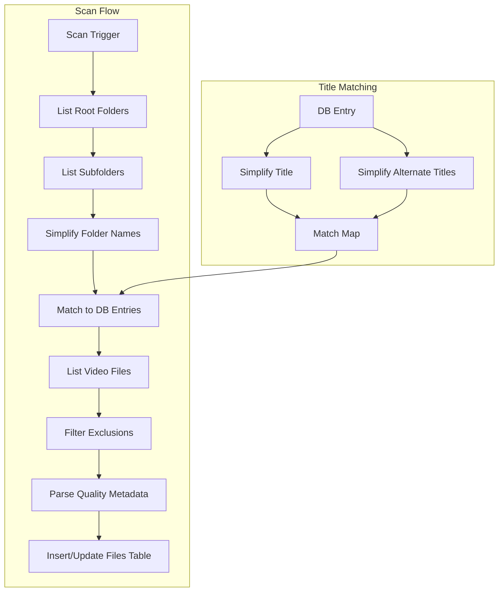

# File Scanning Implementation

## Architecture



## Changes

### 1. Schema: Add seriesId to files table

In [`src/server/db/schema.ts`](src/server/db/schema.ts):

- Add `seriesId` column referencing `series.id`
- Run migration

### 2. New utility module: `src/server/lib/scan.ts`

Core utilities:

```typescript
// Simplify title for matching
function simplifyTitle(title: string): string

// Exclusion patterns (from Sonarr/Radarr)
const EXCLUDED_FOLDERS = /(?:extras|samples?|featurettes|behind the scenes|deleted scenes|interviews|trailers)$/i
const EXCLUDED_FILES = /-(trailer|sample|other|behindthescenes|deleted|featurette|interview|scene|short)\./i

// Video extensions
const VIDEO_EXTENSIONS = ['.mkv', '.mp4', '.avi', '.mov', '.wmv', '.m4v', '.ts', '.webm']

// Quality parsing regexes
const RESOLUTION_REGEX = /\b(480p|720p|1080p|2160p|4k)\b/i
const SOURCE_REGEX = /\b(bluray|blu-ray|bdrip|brrip|hdtv|web-dl|webdl|webrip|web|dvdrip|dvd|hdcam|cam|ts|telesync)\b/i
const CODEC_REGEX = /\b(x264|h\.?264|avc|x265|h\.?265|hevc|xvid|divx|av1)\b/i
```

### 3. New scan routes: `src/server/routes/scan.ts`

**POST /api/scan/movies**

1. Load all movies from DB with alternate titles
2. Build simplified title -> movieId map (includes alternates)
3. For each movie root folder, list subfolders
4. Match folder names to movies using simplified comparison
5. For matched folders, list video files (excluding samples/extras)
6. Parse quality metadata from each filename
7. Upsert into files table

**POST /api/scan/series**

1. Load all series from DB with alternate titles
2. Build simplified title -> seriesId map
3. For each TV root folder, list subfolders
4. Match folder names to series
5. For matched folders, recursively list video files
6. Parse S##E## from filename to get season/episode
7. Look up episodeId from DB
8. Parse quality metadata
9. Upsert into files table (with seriesId + episodeId)

### 4. Episode matching regex

```typescript
// Matches: S01E01, S1E1, 1x01, Season 1 Episode 1
const EPISODE_REGEX = /(?:S(?<season>\d{1,2})E(?<episode>\d{1,3}))|(?:(?<seasonAlt>\d{1,2})x(?<episodeAlt>\d{2,3}))/i
```

## File Structure

```javascript
src/server/
  lib/
    scan.ts          # Core scan utilities
  routes/
    scan.ts          # Scan endpoints
```

## Key Decisions

1. **Multiple folders per entry**: A movie/series can match multiple folders across root paths
2. **Simplified matching**: Remove articles, punctuation, lowercase for fuzzy matching
3. **Quality extraction**: Best-effort regex, null if not found