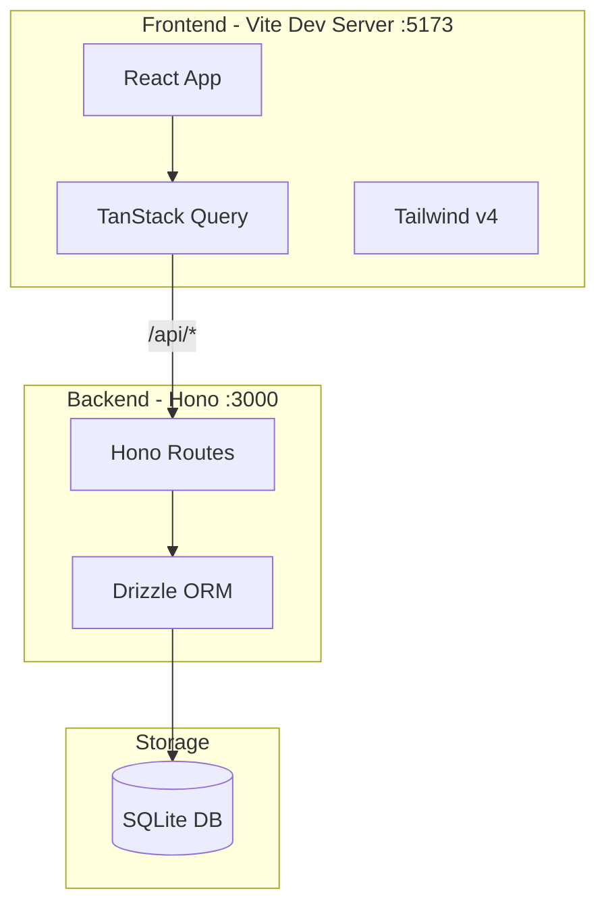

# Admiraltyy Foundation Implementation

## Overview

Initialize the full-stack Bun/TypeScript project with React frontend (Tailwind v4), Hono API backend, and Drizzle ORM with SQLite database. This creates the scaffolding for all subsequent sections.

## Architecture




## Project Structure

```javascript
admiraltyy/
├── src/
│   ├── client/           # React frontend
│   │   ├── components/
│   │   ├── pages/
│   │   ├── hooks/
│   │   ├── lib/
│   │   ├── App.tsx
│   │   ├── main.tsx
│   │   └── index.css
│   ├── server/           # Hono backend
│   │   ├── routes/
│   │   ├── db/
│   │   │   ├── schema.ts
│   │   │   └── index.ts
│   │   ├── services/
│   │   └── index.ts
│   └── shared/           # Shared types
│       └── types.ts
├── public/
├── drizzle/              # Migrations
├── package.json
├── tsconfig.json
├── vite.config.ts
└── drizzle.config.ts
```


## Implementation Steps

### 1. Project Initialization

- Run `bun init` to create package.json
- Install frontend deps: react, react-dom, @tanstack/react-query, lucide-react, vite, @vitejs/plugin-react, tailwindcss@next, @tailwindcss/vite
- Install backend deps: hono, drizzle-orm, better-sqlite3, zod, drizzle-kit

### 2. Configuration Files

- Create `vite.config.ts` with React plugin, Tailwind v4 plugin, and API proxy to :3000
- Create `drizzle.config.ts` pointing to SQLite database
- Create `tsconfig.json` with path aliases (@/client, @/server, @/shared)

### 3. Database Schema

Create `src/server/db/schema.ts` with tables from [01-foundation.md](product-plan/instructions/incremental/01-foundation.md):

- movies, series, seasons, episodes
- files, downloads
- indexers, servers, settings

### 4. Backend API Setup

Create `src/server/index.ts` with Hono app:

- CORS middleware
- Route stubs for /api/movies, /api/series, /api/activity, /api/settings, /api/search
- Health check endpoint at /api/health

### 5. Frontend Setup

- Create `src/client/main.tsx` with React entry point
- Create `src/client/App.tsx` with QueryClientProvider
- Create `src/client/index.css` with Tailwind v4 imports and design tokens from [colors.json](product-plan/design-system/colors.json) and [typography.json](product-plan/design-system/typography.json)

### 6. NPM Scripts

Add to package.json:

- `dev` - Start Vite dev server
- `server` - Start Hono backend
- `db:generate` - Generate Drizzle migrations
- `db:push` - Push schema to database

## Design System Integration

CSS custom properties for the design system:

- **Primary**: blue-500 base, blue-600 hover, blue-700 active
- **Neutral**: slate palette for backgrounds, borders, text
- **Status**: emerald (success), amber (warning), red (error)
- **Typography**: Inter for headings/body, JetBrains Mono for code

## Verification Checklist

After implementation:

- `bun run dev` starts the frontend on :5173
- `bun run server` starts the API on :3000