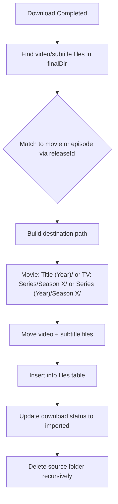

# Media File Importing

## Schema Changes

Add `importing` and `imported` statuses to [`src/server/db/schema.ts`](src/server/db/schema.ts):

```typescript
export const downloadStatuses = ['queued', 'downloading', 'paused', 'unpacking', 'verifying', 'importing', 'completed', 'imported', 'failed'] as const
```

Add a migration in `drizzle/` to update the enum constraint (if needed for SQLite).

## Import Service

Create [`src/server/import/importService.ts`](src/server/import/importService.ts):



Key logic:

- **Video extensions**: `.mkv`, `.mp4`, `.avi`, `.m4v`, `.mov`, `.wmv`
- **Subtitle extensions**: `.srt`, `.sub`, `.ssa`, `.ass`, `.vtt`
- **Folder cleaning**: Strip `_UNPACK_`, `_FAILED_`, `-xpost`, etc. from names
- **Movie path**: `{movieFolder}/{Title} ({Year})/{file}` (always include year)
- **TV path naming**:
  - Check `series.useYearInFolder` flag from database
  - If `false`: `{tvFolder}/{Series Title}/Season {n}/{file}`
  - If `true`: `{tvFolder}/{Series Title} ({Year})/Season {n}/{file}`
- **Cleanup**: Always delete source folder after import (recursively, even if not empty)

## Integration

Modify [`src/server/nzbget/nzbgetApi.ts`](src/server/nzbget/nzbgetApi.ts) `syncNzbgetHistory`:

- After updating status to `completed`, if `unpackStatus === 'SUCCESS'`:
  - Set status to `importing`
  - Call import service
  - On success: status = `imported`
  - On failure: status = `failed` with error message

## UI Updates

Update [`src/client/routes/activity/-downloads-table.tsx`](src/client/routes/activity/-downloads-table.tsx):

- Add `importing` and `imported` status badges
- Add `importing` to `queueStatuses` so it shows in queue section with progress indicator

Update filter tabs to include `imported` filter option.