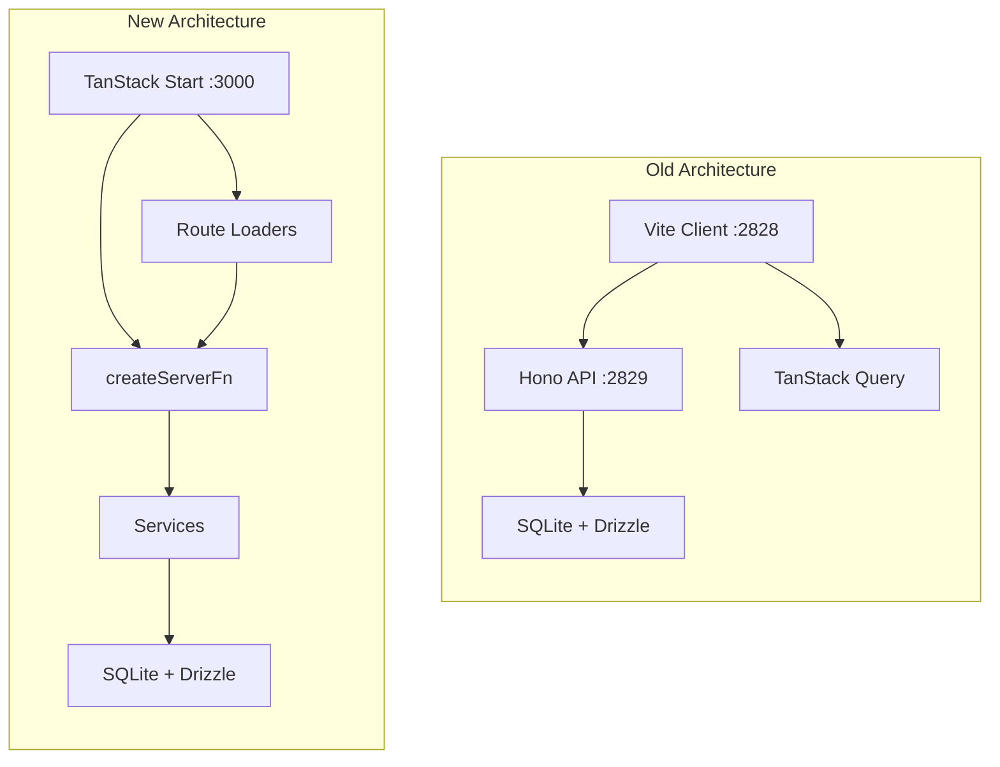

# TanStack Start Migration Plan

## Architecture Overview



## Target Directory Structure

```text
src/
  db/
    index.ts           # Drizzle connection (from src_old/server/db)
    schema.ts          # Full schema (from src_old/server/db)
  services/
    movies.ts          # Server functions for movies
    series.ts          # Server functions for series
    tasks.ts           # File scan server functions
    settings.ts        # Settings management + server fns
    activity.ts        # Downloads/NZBGet server fns
    search.ts          # TMDB search server fn
    tmdb.ts            # TMDB API utilities (pure logic)
    fileScan.ts        # File scanning utilities (pure logic)
    fileImport.ts      # File import logic (pure logic)
    nzbget/
      api.ts           # NZBGet RPC client
      poller.ts        # Background polling
      process.ts       # NZBGet process management
      schema.ts        # NZBGet types
  routes/
    __root.tsx         # Root layout with Header
    index.tsx          # Dashboard
    movies/
      index.tsx        # Movies list with loader
      $movieId.tsx     # Movie detail with loader
      -movie-card.tsx  # Collocated component
      -movie-filters.tsx
      -movies-footer.tsx
    tv/
      index.tsx
      $seriesId.tsx
      -series-card.tsx
      ...
    activity/
      index.tsx        # Downloads/queue view
      -downloads-table.tsx
      ...
    settings/
      index.tsx        # Settings page
      -folder-section.tsx
      ...
    add/
      route.tsx        # Add movie/series dialog
      -add-movie-dialog.tsx
      ...
    tasks.tsx          # Tasks page (scan buttons)
  components/
    header.tsx
    delete-confirmation-modal.tsx
    movie-manual-search-dialog.tsx
    ui/               # shadcn/ui components (copy from src_old)
  lib/
    utils.ts          # cn() helper
  env.ts              # Environment config
  styles.css          # Global CSS (merge from src_old/client/index.css)
  router.tsx          # Router factory
  routeTree.gen.ts    # Generated
```

## Key Migration Patterns

### 1. Server Functions Replace API Routes

Old Hono route:

```typescript
// src_old/server/routes/movies.ts
.get('/', async (c) => {
  const movies = await listMoviePreviews()
  return c.json(movies)
})
```

New server function (in [`src/services/movies.ts`](src/services/movies.ts)):

```typescript
import { createServerFn } from '@tanstack/react-start'
import { db, schema } from '@/db'

export const listMovies = createServerFn({ method: 'GET' })
  .handler(async () => {
    // Same DB query logic
    return await db.all(sql`SELECT ...`)
  })
```

### 2. Route Loaders Replace useQuery

Old pattern:

```typescript
const { data: movies, isLoading } = useMovies()
```

New pattern:

```typescript
export const Route = createFileRoute('/movies/')({
  loader: () => listMovies(),
  component: MoviesPage,
})

function MoviesPage() {
  const movies = Route.useLoaderData()
  // movies is directly available, no loading state needed
}
```

### 3. Mutations + Invalidation Replace useMutation

Old pattern:

```typescript
const deleteMovie = useDeleteMovie({ onSuccess: () => setTarget(null) })
deleteMovie.mutate({ param: { id: '123' } })
```

New pattern:

```typescript
const router = useRouter()

async function handleDelete(movieId: number) {
  await deleteMovieFn({ data: { movieId } })
  router.invalidate() // Refetches all route loaders
}
```

## Migration Steps

### Phase 1: Foundation Setup

1. **Copy database schema**: Replace placeholder [`src/db/schema.ts`](src/db/schema.ts) with full schema from [`src_old/server/db/schema.ts`](src_old/server/db/schema.ts)

2. **Update db connection**: Modify [`src/db/index.ts`](src/db/index.ts) to use Bun SQLite with proper path configuration (from [`src_old/server/db/index.ts`](src_old/server/db/index.ts))

3. **Copy env config**: Migrate [`src_old/server/env.ts`](src_old/server/env.ts) to [`src/env.ts`](src/env.ts) with paths configuration

4. **Copy UI components**: Move all shadcn/ui components from [`src_old/client/components/ui/`](src_old/client/components/ui/) to [`src/components/ui/`](src/components/ui/)

5. **Merge CSS**: Merge [`src_old/client/index.css`](src_old/client/index.css) into [`src/styles.css`](src/styles.css)

### Phase 2: Services Layer

Create server functions for each domain in `src/services/`:

1. **movies.ts**: `listMovies`, `getMovie`, `createMovie`, `updateMovie`, `deleteMovie`, `searchMovieReleases`, `grabMovieRelease`

2. **series.ts**: `listSeries`, `getSeries`, `createSeries`, `updateSeries`, `deleteSeries`, etc.

3. **activity.ts**: `listDownloads`, `deleteDownload`, `getNzbgetStatus`, `getNzbgetQueue`, `getNzbgetHistory`, `syncNzbget`

4. **settings.ts**: `getSettings`, `updateSettings`, `testUsenetServer`

5. **search.ts**: `searchMulti` (wraps TMDB search)

6. **tasks.ts**: `scanMoviesFiles`, `scanSeriesFiles`

### Phase 3: Pure Utility Modules

Copy without changes (no server function wrappers needed):

- [`src_old/server/services/tmdb.ts`](src_old/server/services/tmdb.ts) -> `src/services/tmdb.ts`
- [`src_old/server/services/fileScan.ts`](src_old/server/services/fileScan.ts) -> `src/services/fileScan.ts`  
- [`src_old/server/services/fileImport.ts`](src_old/server/services/fileImport.ts) -> `src/services/fileImport.ts`
- [`src_old/server/nzbget/*`](src_old/server/nzbget/) -> `src/services/nzbget/`
- [`src_old/server/settings.ts`](src_old/server/settings.ts) -> `src/services/settings.ts` (file-based settings manager)

### Phase 4: Routes Migration

For each route, convert from TanStack Query to route loaders:

1. **Movies route** ([`src_old/client/routes/movies/index.tsx`](src_old/client/routes/movies/index.tsx)):

   - Add `loader: () => listMovies()` 
   - Replace `useMovies()` with `Route.useLoaderData()`
   - Replace `useDeleteMovie()` with direct `await deleteMovie({...}); router.invalidate()`

2. **Movie detail** ([`src_old/client/routes/movies/$movieId.tsx`](src_old/client/routes/movies/$movieId.tsx)):

   - Add `loader: ({ params }) => getMovie({ data: { movieId: params.movieId } })`
   - Use `Route.useLoaderData()` for movie data

3. **Repeat for**: TV routes, Activity, Settings, Add, Tasks

### Phase 5: Root Layout & Initialization

1. **Update `__root.tsx`**: 

   - Remove TanStack Query provider
   - Keep Header + devtools
   - Initialize settings/NZBGet via route loader or on-demand

2. **Update `router.tsx`**: Remove query client context

3. **Disable SSR** in vite config (SPA mode only - already using nitro)

### Phase 6: Cleanup

1. Remove TanStack Query dependencies from `package.json`:

   - `@tanstack/react-query`
   - `@tanstack/react-query-devtools`
   - `hono-rpc-query`
   - `hono` (if not needed elsewhere)

2. Remove old client/server separation artifacts

3. Run `bun fix && bun tsc` to verify

## Files to Create/Modify

| Action | Path | Notes |

|--------|------|-------|

| Replace | `src/db/schema.ts` | Full schema from src_old |

| Modify | `src/db/index.ts` | Bun SQLite connection |

| Modify | `src/env.ts` | Paths configuration |

| Create | `src/services/movies.ts` | Server functions |

| Create | `src/services/series.ts` | Server functions |

| Create | `src/services/activity.ts` | Server functions |

| Create | `src/services/settings.ts` | Server fns + logic |

| Create | `src/services/search.ts` | Server function |

| Create | `src/services/tasks.ts` | Server functions |

| Copy | `src/services/tmdb.ts` | Pure utility |

| Copy | `src/services/fileScan.ts` | Pure utility |

| Copy | `src/services/fileImport.ts` | Pure utility |

| Copy | `src/services/nzbget/*` | NZBGet modules |

| Copy | `src/components/ui/*` | shadcn components |

| Migrate | `src/components/header.tsx` | From src_old |

| Copy | `src/components/*.tsx` | Modals, dialogs |

| Migrate | `src/routes/__root.tsx` | Remove Query provider |

| Migrate | `src/routes/movies/*` | Convert to loaders |

| Migrate | `src/routes/tv/*` | Convert to loaders |

| Migrate | `src/routes/activity/*` | Convert to loaders |

| Migrate | `src/routes/settings/*` | Convert to loaders |

| Migrate | `src/routes/add/*` | Convert to loaders |

| Migrate | `src/routes/tasks.tsx` | Convert to loaders |

| Modify | `src/styles.css` | Merge old CSS |

| Modify | `package.json` | Remove Query deps |